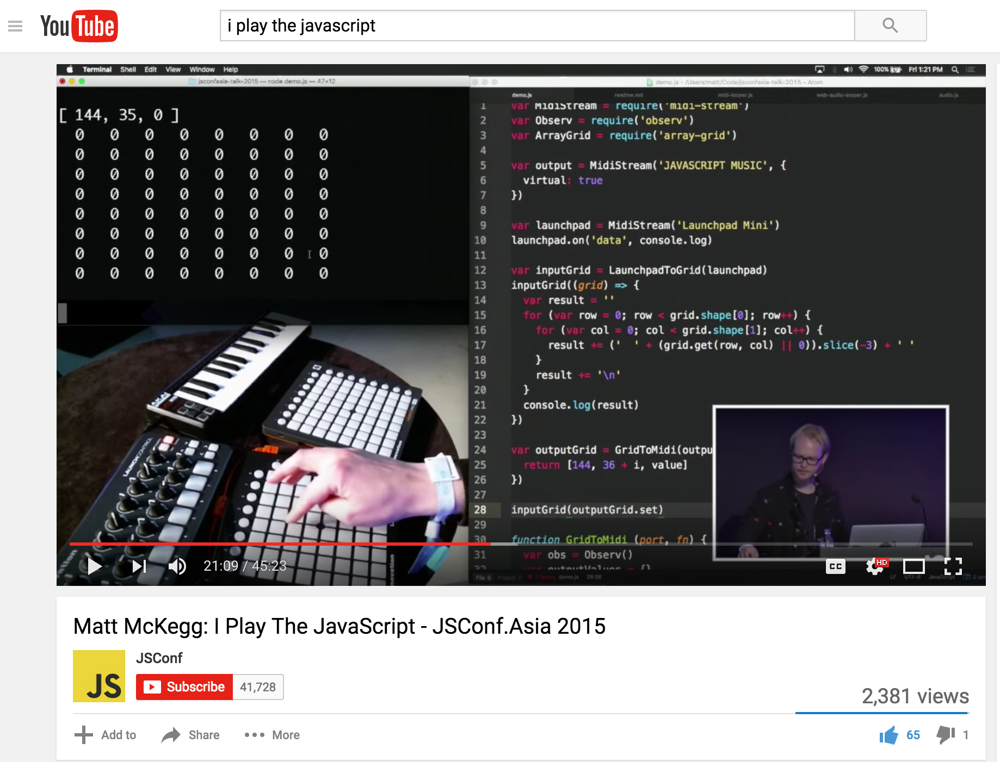

# I make **music** with **computers**.

💥~🤖~💥

# I also make **_software_** to make **music** with **computers**.

https://www.youtube.com/watch?v=01_udUeZ2GU

# _Why would you do that?_

# Playing computer music **live** is ... uh... _complicated_.

> For most bands and musicians this is not a problem. If you are a guitarist, it makes no difference whether you are playing on stage or recording in a studio. In both cases, you are playing the guitar. In most cases with music, the album is just a recording of what the musicians would do anyway. The great thing about this is the musician can intuitively pick up on the feeling in the room and change the way the are playing to accommodate this. They might not even notice they're doing it. There is this amazing feeling that comes from a band jamming with each other, and vibing off the audience.

> But this is not the case with most computer music. I was creating music on a timeline.

### **Painted**, not played.

> This leaves only a few options.

## _Option 1_: Recruit some musicians and **play it for real**!

> This is actually something that would be a lot of fun, but it is not representative of my musical process. I'd be doing completely different things in the studio to what I'm doing on stage. It would be treating the album like a score, things would get very complicated very quick with the amount of sounds I use.

## _Option 2_: **DJ it!** (_just press play..._)

> The performance would be more like an exhibition, much like how a painter would present their work. But I don't find this very fun. I want to perform, share and be in the moment with the audience, able to easily adapt to the room vibe. Not just a boring and predictable exhibit.

## _Option 3_: Play **everything** yourself!

> https://www.youtube.com/watch?v=iHSMnWpyIeM

> This was the option I wanted to go with. But my songs are already sequenced. How to go about destructuring and playing?

> I had this crazy idea that I'd take my existing songs, and learn how to play all the individual parts and then build them up one loop at a time.

### **Recording anxiety**

> I suffer from acute recording anxiety. This was always a problem. I’d be jamming away a cool riff, and it sounds awesome, then I hit record and my figures turn to jelly, and it comes out all wrong. I looked long and hard for a solution, but couldn't find anything reliable. It was time to build my own solution.

## **Time travel** with Node.js

> I created a Node.js script that allowed me more control over input, storing all MIDI in a buffer, and then allowing me to go back in time and create loops after I played them, along with some realtime loop transform controls.

> In the process of trying to learn my songs, and failing kind of miserably, I managed to develop a lot of the core looping concepts that still exist in Loop Drop today.

## _Previously on JSConf.asia_...

``youtu.be/NL0nb8A8FDM``

## **Loop Drop** — loopjs.com

>> [Play some tunes](https://www.youtube.com/watch?v=5zutWpFG8pk) and give a quick overview of how it works.

>> Sample the audience and make a song!

## Loop Drop is **JavaScript**!

> Loop Drop is a desktop application that you can install on your computer. But it is actually 100% JavaScript! This is achieved using Electron (made by Github), which combines Node.js with Chromium giving you everything you'd ever want!

Electron - **Chromium + Node.js**

http://electron.atom.io

# Contributing

- github.com/mmckegg/loop-drop-app
- patreon.com/MattMcKegg

# DESTROY WITH SCIENCE

Loop Drop R&D **super secret\*** laboratory!

- soundcloud.com/destroy-with-science
- destroywithscience.bandcamp.com/album/droptivist
